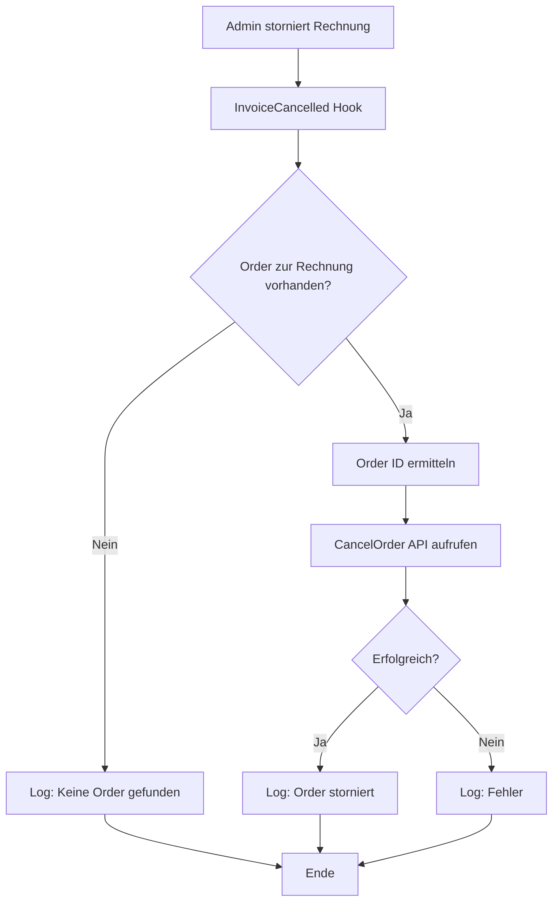

# WHMCS Action Hook: Cancel Order on Invoice Cancelled

[](https://www.whmcs.com)
[](https://www.php.net)
[](LICENSE)

**Storniert automatisch Bestellungen (Orders), wenn die zugehörige Rechnung storniert wird.**


## 📋 Übersicht

Dieser Action Hook erweitert WHMCS um eine wichtige Automatisierung: Wenn eine Rechnung storniert wird, wird die zugehörige Bestellung automatisch ebenfalls storniert. Dies verhindert inkonsistente Zustände und reduziert manuellen Aufwand.

### ✨ Hauptfunktionen

- 🔄 **Automatische Synchronisation** – Orders werden bei Invoice-Stornierung automatisch storniert
- 📊 **Activity Logging** – Alle Aktionen werden im WHMCS Activity Log protokolliert
- 🛡️ **Fehlerbehandlung** – Robustes Exception-Handling verhindert Systemfehler
- ✅ **Smart Detection** – Erkennt automatisch ob eine Order zur Rechnung existiert
- 🔒 **Sicher** – Verwendet WHMCS API statt direkter Datenbankmanipulation
- 🚀 **Performance-optimiert** – Minimale Datenbankabfragen

### 🎯 Anwendungsfall

**Problem:** Wenn Rechnungen manuell storniert werden, bleiben die zugehörigen Orders aktiv:
- Services bleiben fälschlicherweise "Pending" oder "Active"
- Kunden erhalten verwirrende Status-Updates
- Manuelles Nacharbeiten erforderlich
- Inkonsistente Datenhaltung

**Lösung:** Automatische Stornierung der Order beim Stornieren der Rechnung!

## 🚀 Installation

### Schritt 1: Datei hochladen

Lade die Datei `zigetik_cancel_order_on_invoice_cancelled.php` in das Hook-Verzeichnis:

```bash
/pfad/zu/whmcs/includes/hooks/zigetik_cancel_order_on_invoice_cancelled.php
```

### Schritt 2: Fertig!

Der Hook wird automatisch aktiviert. Keine weitere Konfiguration nötig.

### Schritt 3: Testen

1. Erstelle eine Test-Bestellung in WHMCS
2. Storniere die zugehörige Rechnung
3. Prüfe, ob die Order automatisch storniert wurde ✅
4. Überprüfe das Activity Log für Einträge

## 📊 Funktionsweise

### Workflow-Diagramm



### Ablauf im Detail

1. **Hook-Trigger**: `InvoiceCancelled` Event wird ausgelöst
2. **Validierung**: Prüfung ob Invoice ID vorhanden
3. **Order-Suche**: Datenbankabfrage nach zugehöriger Order
4. **API-Call**: `CancelOrder` via WHMCS interne API
5. **Logging**: Erfolg/Fehler wird protokolliert

### Code-Logik

```php
// 1. Validierung
if (empty($vars['invoiceid'])) {
    return; // Keine Invoice ID
}

// 2. Order finden
$order = Capsule::table('tblorders')
    ->where('invoiceid', $vars['invoiceid'])
    ->first();

// 3. Order stornieren (falls vorhanden)
if ($order) {
    localAPI('CancelOrder', ['orderid' => $order->id]);
}
```

## 📝 Activity Log Beispiele

### Erfolgreiche Stornierung

```
[2024-02-09 15:30:12] Order #456 automatically cancelled due to invoice #123 cancellation
```

### Keine Order gefunden

```
[2024-02-09 15:32:45] Cancel Order Hook: No order found for invoice #789
```

### Fehlerfall

```
[2024-02-09 15:35:20] Cancel Order Hook Error: Failed to cancel order #999 - Order Already Cancelled
```

## ⚙️ Technische Details

### Verwendete Hooks

| Hook | Funktion |
|------|----------|
| `InvoiceCancelled` | Wird ausgelöst wenn eine Rechnung storniert wird |

### WHMCS API Calls

| API Function | Zweck |
|--------------|-------|
| `CancelOrder` | Storniert die Bestellung über offizielle API |

### Sicherheitsmerkmale

✅ **API-basiert** – Verwendet `localAPI()` statt direkter DB-Updates  
✅ **Exception-Handling** – Try-Catch für alle kritischen Operationen  
✅ **Input-Validierung** – Prüfung aller Eingabeparameter  
✅ **Logging** – Vollständige Nachverfolgbarkeit aller Aktionen  
✅ **Null-Safe** – Prüfung auf leere/fehlende Werte

### Systemanforderungen

| Anforderung | Version |
|-------------|---------|
| WHMCS | 9.0 oder höher |
| PHP | 8.1, 8.2, 8.3 |
| MySQL/MariaDB | 5.7+ / 10.3+ |

### Datenbankzugriff

Der Hook verwendet folgende Tabellen (read-only):

- `tblorders` – Order-Daten (SELECT)
- `tblinvoices` – Invoice-Daten (via Hook-Variable)

Schreibzugriff erfolgt nur über WHMCS API:

- `CancelOrder` – Order stornieren

## 🔧 Anpassungsmöglichkeiten

### E-Mail-Benachrichtigung hinzufügen

```php
if ($result['result'] === 'success') {
    // Admin benachrichtigen
    localAPI('SendEmail', [
        'messagename' => 'Admin Order Cancellation Notice',
        'id' => $order->userid,
        'customvars' => [
            'order_id' => $order->id,
            'invoice_id' => $vars['invoiceid']
        ]
    ]);
}
```

### Nur bestimmte Order-Status stornieren

```php
// Erweiterte Order-Abfrage
$order = Capsule::table('tblorders')
    ->where('invoiceid', $vars['invoiceid'])
    ->whereIn('status', ['Pending', 'Active']) // Nur diese Status
    ->select('id', 'userid', 'status')
    ->first();
```

### Custom Field in Order setzen

```php
// Grund der Stornierung speichern
Capsule::table('tblcustomfieldsvalues')->updateOrInsert(
    [
        'relid' => $order->id,
        'fieldid' => 12 // Custom Field ID
    ],
    [
        'value' => 'Automatically cancelled - Invoice #' . $vars['invoiceid'] . ' cancelled'
    ]
);
```

## 🧪 Testing

### Manueller Test

```php
// 1. Erstelle Test-Order
WHMCS Admin → Orders → Add New Order

// 2. Rechnung wird automatisch erstellt
Prüfe: Orders → View Order → Invoice Link

// 3. Storniere Rechnung
Billing → Invoices → Cancel Invoice

// 4. Prüfe Order-Status
Orders → View Order
Status sollte jetzt "Cancelled" sein

// 5. Prüfe Activity Log
Utilities → Logs → Activity Log
Suche nach: "automatically cancelled"
```

### Test-Szenarien

| Szenario | Erwartetes Verhalten |
|----------|---------------------|
| Rechnung mit Order stornieren | Order wird automatisch storniert |
| Rechnung ohne Order stornieren | Log-Eintrag "No order found" |
| Bereits stornierte Order | Fehler-Log, keine Doppel-Stornierung |
| Ungültige Invoice ID | Hook terminiert sicher |

## 🔍 Troubleshooting

### Problem: Order wird nicht storniert

**Mögliche Ursachen:**

1. **Hook-Datei nicht korrekt platziert**
   ```bash
   # Prüfen
   ls -la /pfad/zu/whmcs/includes/hooks/zigetik_cancel_order_on_invoice_cancelled.php
   ```

2. **Dateiberechtigungen falsch**
   ```bash
   # Korrigieren
   chmod 644 /pfad/zu/whmcs/includes/hooks/zigetik_cancel_order_on_invoice_cancelled.php
   ```

3. **Order bereits manuell storniert**
   ```
   Activity Log zeigt: "Order Already Cancelled"
   ```

### Problem: Fehler im Activity Log

**Lösung:**

```bash
# Activity Log prüfen
WHMCS Admin → Utilities → Logs → Activity Log

# Nach diesen Einträgen suchen:
- "Cancel Order Hook Error"
- "Cancel Order Hook Exception"

# Debug-Modus aktivieren (in configuration.php)
$display_errors = "On";
$error_reporting = E_ALL;
```

### Problem: Keine Log-Einträge

**Prüfe:**

1. Hook-Datei korrekt hochgeladen?
2. PHP-Fehler im Error-Log?
3. WHMCS Hooks aktiviert? (Setup → General Settings → Other → Enable Hooks)

## 📋 Best Practices

### Wann sollte dieser Hook NICHT verwendet werden?

❌ **Nicht verwenden wenn:**
- Du Orders manuell verwalten möchtest
- Rechnungen oft "versehentlich" storniert werden
- Spezielle Workflows abhängig von Order-Status sind

✅ **Verwenden wenn:**
- Automatisierung gewünscht ist
- Konsistente Datenhaltung wichtig ist
- Viele Rechnungen storniert werden

### Empfohlene Ergänzungen

```php
// 1. E-Mail an Kunde senden
localAPI('SendEmail', [
    'messagename' => 'Order Cancellation Confirmation',
    'id' => $order->userid
]);

// 2. Services beenden
$services = Capsule::table('tblhosting')
    ->where('orderid', $order->id)
    ->pluck('id');

foreach ($services as $serviceId) {
    localAPI('ModuleTerminate', ['serviceid' => $serviceId]);
}
```

## 🤝 Beitragen

Contributions sind willkommen! So kannst du helfen:

1. **Fork** das Repository
2. **Erstelle** einen Feature-Branch (`git checkout -b feature/EmailNotification`)
3. **Commit** deine Änderungen (`git commit -m 'Add email notification on cancel'`)
4. **Push** zum Branch (`git push origin feature/EmailNotification`)
5. **Öffne** einen Pull Request

### Development Guidelines

- Code nach **PSR-12** formatieren
- **PHPDoc** für alle Funktionen
- **Logging** für alle wichtigen Aktionen
- **Exception-Handling** für API-Calls

## 📜 Changelog

### Version 2.0 (2024-02-09)

- ✅ WHMCS 9.0 Kompatibilität
- ✅ PHP 8.2/8.3 Support
- ✅ Erweiterte Fehlerbehandlung
- ✅ Verbessertes Activity Logging
- ✅ Null-Safe Operations
- ✅ Code-Dokumentation auf Deutsch

### Version 1.0 (Original)

- Erste Version von Katamaze
- Basis-Funktionalität

## 📄 Lizenz

MIT License

```
Copyright (c) 2024 ZIGetik Webservices

Permission is hereby granted, free of charge, to any person obtaining a copy
of this software and associated documentation files (the "Software"), to deal
in the Software without restriction, including without limitation the rights
to use, copy, modify, merge, publish, distribute, sublicense, and/or sell
copies of the Software, and to permit persons to whom the Software is
furnished to do so, subject to the following conditions:

The above copyright notice and this permission notice shall be included in all
copies or substantial portions of the Software.

THE SOFTWARE IS PROVIDED "AS IS", WITHOUT WARRANTY OF ANY KIND, EXPRESS OR
IMPLIED, INCLUDING BUT NOT LIMITED TO THE WARRANTIES OF MERCHANTABILITY,
FITNESS FOR A PARTICULAR PURPOSE AND NONINFRINGEMENT.
```

## 👨‍💻 Credits

**Entwickelt von:**  
🚀 **ZIGetik Webservices**  
📧 kontakt@zigetik.com  
🌐 https://zigetik.com

**Basierend auf dem Original-Konzept von:**  
💡 [Katamaze](https://katamaze.com)

## ⭐ Support & Community

- 🐛 **Bug melden:** [GitHub Issues](../../issues)
- 💡 **Feature Request:** [GitHub Discussions](../../discussions)
- 📧 **Direkt-Support:** info@zigetik.com
- 📚 **WHMCS Docs:** https://docs.whmcs.com

## 🔗 Verwandte Projekte

- [Accept Quote without Login](https://github.com/zigetik/whmcs-accept-quote-without-login) – Quote-Akzeptierung ohne Login
- Weitere WHMCS Hooks von ZIGetik Webservices

---

<div align="center">

**Gefällt dir das Projekt?**  
Gib uns einen ⭐ auf GitHub!

[⬆ Nach oben](#whmcs-action-hook-cancel-order-on-invoice-cancelled)

</div>
